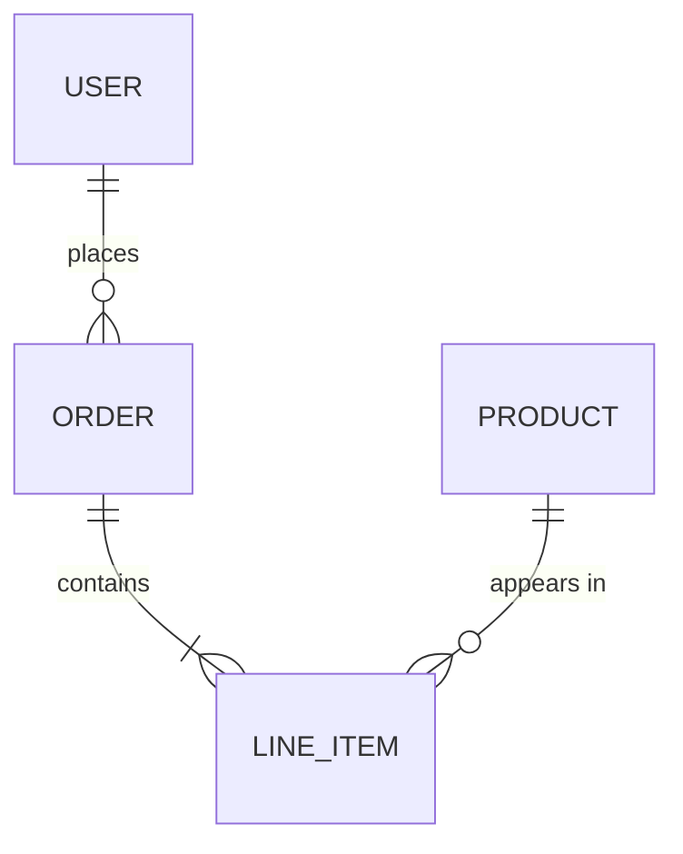

# Schema Design and Query Patterns

## Normalization levels

| Form | Rule                                         | Violation example                        |
| ---- | -------------------------------------------- | ---------------------------------------- |
| 1NF  | Atomic values, no repeating groups           | `tags TEXT` storing comma-separated list  |
| 2NF  | No partial dependencies on composite keys    | Non-key column depends on part of PK     |
| 3NF  | No transitive dependencies                   | `zip -> city` stored alongside `user_id` |
| BCNF | Every determinant is a candidate key         | Rare; matters in complex composite keys  |

### When to stop normalizing

3NF is the practical target for OLTP. Go to BCNF only when you observe update
anomalies. Over-normalization causes excessive JOINs and hurts read performance.

## Denormalization strategy

Denormalize deliberately, not accidentally. Valid reasons:

1. **Read-heavy workload** -- Materialized views or summary tables
2. **Eliminating expensive JOINs** -- Embedding foreign data that rarely changes
3. **Reporting/analytics** -- Star schema or pre-aggregated tables

Always document why a denormalization exists (comment in migration file).
Maintain the normalized source of truth; denormalized copies are derived.

## ERD generation from DDL

Parse CREATE TABLE statements to extract:
- Table names and columns (type, nullable, default)
- PRIMARY KEY and UNIQUE constraints
- FOREIGN KEY relationships (one-to-one, one-to-many, many-to-many)
- CHECK constraints

Render as Mermaid erDiagram:



## Query patterns

### JOINs -- choose the right type

| JOIN type   | Use when                                         |
| ----------- | ------------------------------------------------ |
| INNER       | Both sides must match                            |
| LEFT        | Keep all left rows, NULL for missing right        |
| CROSS       | Cartesian product (rare, usually a mistake)      |
| LATERAL     | Correlated subquery per row (PostgreSQL)          |

### CTEs (Common Table Expressions)

Use CTEs for readability. PostgreSQL 12+ materializes only when beneficial.

```sql
WITH active_users AS (
    SELECT id, email FROM users WHERE last_login > NOW() - INTERVAL '30 days'
)
SELECT au.email, COUNT(o.id) AS order_count
FROM active_users au
JOIN orders o ON o.user_id = au.id
GROUP BY au.email;
```

### Recursive CTEs

For tree/graph traversal (org charts, category hierarchies):

```sql
WITH RECURSIVE tree AS (
    SELECT id, name, parent_id, 0 AS depth
    FROM categories WHERE parent_id IS NULL
    UNION ALL
    SELECT c.id, c.name, c.parent_id, t.depth + 1
    FROM categories c JOIN tree t ON c.parent_id = t.id
)
SELECT * FROM tree ORDER BY depth, name;
```

Always add a depth limit (`WHERE depth < 100`) to prevent infinite recursion.

### Window functions

```sql
SELECT
    user_id,
    amount,
    SUM(amount) OVER (PARTITION BY user_id ORDER BY created_at) AS running_total,
    ROW_NUMBER() OVER (PARTITION BY user_id ORDER BY created_at DESC) AS recency_rank
FROM orders;
```

Use `ROW_NUMBER` for deduplication, `RANK`/`DENSE_RANK` when ties matter.

## N+1 detection

Signs of N+1 in application code:

1. Loop that executes a query per item from a parent query
2. ORM lazy-loading associations inside iteration
3. GraphQL resolvers fetching related data per parent node

Fixes:
- **Eager loading** -- `includes` / `preload` / `JOIN FETCH`
- **Batch loading** -- DataLoader pattern (GraphQL), `WHERE id IN (...)`
- **Subquery** -- Push the logic into SQL instead of application code

### Incorrect (N+1)

```python
users = db.query("SELECT * FROM users")
for user in users:
    orders = db.query(f"SELECT * FROM orders WHERE user_id = {user.id}")
```

### Correct (single query)

```python
rows = db.query("""
    SELECT u.*, o.id AS order_id, o.amount
    FROM users u
    LEFT JOIN orders o ON o.user_id = u.id
""")
```
